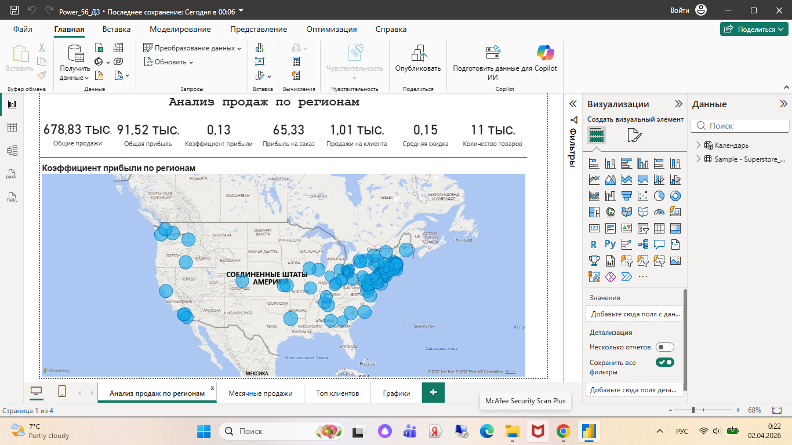
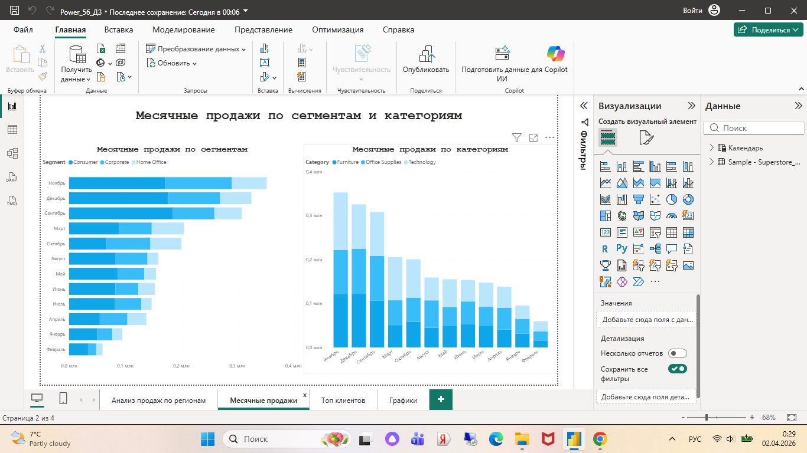
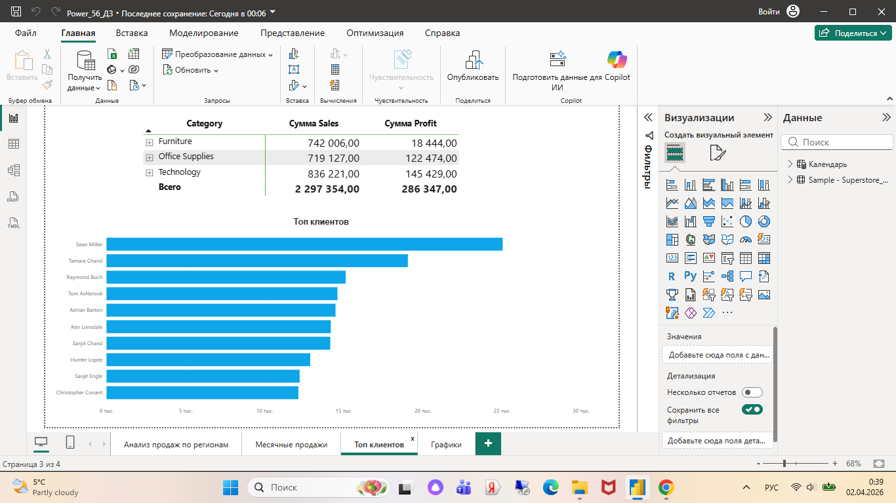
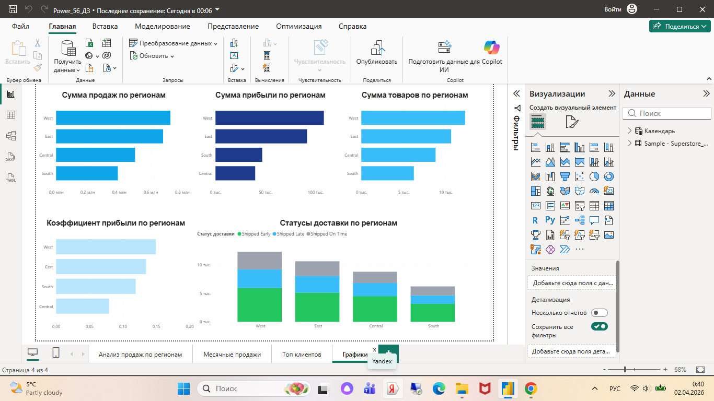

# Анализ продаж и прибыли (Power BI Dashboard)

Проект представляет собой интерактивный дашборд для анализа ключевых бизнес-показателей. В отчете реализована фильтрация по регионам, времени и сегментам клиентов.

## 📊 Визуализация дашборда

### 1. Анализ продаж по регионам
Изучение географического распределения прибыли и объемов продаж.

### 2. Месячные продажи
Анализ временных рядов для выявления сезонности и трендов роста.

### 3. Топ клиентов
Сегментация и выявление наиболее прибыльных покупателей.

### 4. Графики и зависимости
Дополнительные визуализации корреляций и структуры данных.

## 🛠 Технический стек
* **Инструмент:** Power BI Desktop
* **Файл проекта:** `Power_56_ДЗ.pbix`
* **Основные функции:** DAX (меры для KPI), Power Query (обработка данных), картография.
